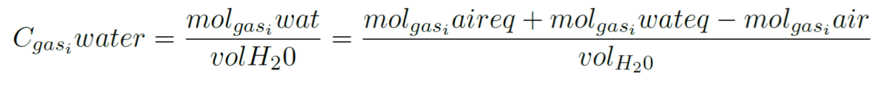
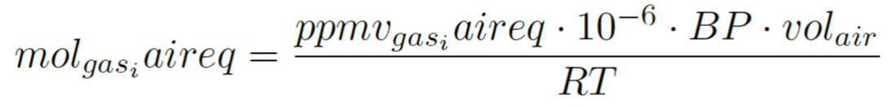
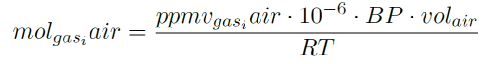
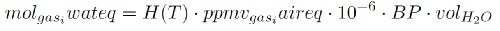
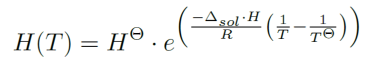
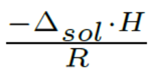
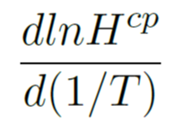
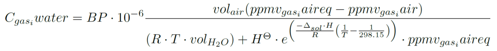

NEON Dissolved Gas - Python version
================

<!-- ****** Description ****** -->
This is a Python implementation of the scripts in the R package for calculating dissolved gas concentrations in surface water samples. Needs to be run using Python version 3 (not version 2). For initial data formatting, it is necessary to use R and the R package `neonUtilities` to get the `.csv` input files required for these Python scripts.

<!-- ****** Installation ****** -->
These Python scripts require the `numpy` and `pandas` packages in order to run. One possible way to install these (and Python if needed) is through the miniconda package manager <a href="https://docs.conda.io/en/latest/miniconda.html">.

<!-- ****** Usage ****** -->
Usage
-----

The functions in this package have the following purpose: (1) to format downloaded data, (2) to calculate dissolved gas concentrations in surface water (mol L-1) from headspace source gas and equilibrated air (ppmv) concentrations, (3) to calculate 100% saturation dissolved gas concenrations (i.e. dissolved gas concentrations in equilibrium with atmosphere) from water temperature, barometric pressure, and atmospheric concentrations (ppmv). See help files for individual functions for details. The general work flow with the Python scripts is slightly different compared to using the R package, but they should give the same results:

1.  download data from the NEON data portal (as a `.zip` archive), into any location
2.  Use the `stackByTable` function in the `neonUtilities` package in `R` to extract the `.zip` archive and stack the files that it contains into different data tables (`.csv` format) required for these Python scripts. More information about using `neonUtilities`, including tutorials is here: <a href="https://www.neonscience.org/neonDataStackR"> 
3.  sdg\_data &lt;- def.format.sdg(dataDir = "myDataPath"), returns a data frame called sdg\_data
4.  sdg\_calc &lt;- def.calc.sdg.conc(sdg\_data), returns a data frame called sdg\_calc with molar concentrations appended as columns
5.  sdg\_sat &lt;- def.calc.sdg.sat(sdg\_calc), returns a data frame called sdg\_sat with gas 100% saturation concentrations and percent saturation in the water

<!-- ****** Calculation Summary ****** -->
Calculation Summary
-------------------

The concentration of gasi dissolved in the original water sample (mol L-1) is calculated from a mass balance of the measured headspace mixing ratio of gasi (ppmv), the calculated concentration in the equilibrated headspace water, and the volumes of the headspace water and headspace gas. The calculations also require the pressure of the headspace equilibration (assumed to be equal to barometric pressure during sampling), the temperature of the headspace equilibration, the universal gas constant (R), and the Henry's Law Solubility Constant corrected to the temperature of the headspace equilibration system.

The 100% saturation concentration (i.e. dissolved gas concentrations in equilibrium with atmosphere) is calculated from the temperature of the water body, atmospheric pressure, and the concentration in the atmosphere (ppmv).

The following applies to gasi, where gasi is equal to CH4, N2O, or CO2

1.  The gas constant, R, equals 8.3144598 L kPa K-1 mol-1
2.  The dissolved gas concentration in the original water sample is calculated from a mass balance of the headspace equilibration system:
    -   *Cgasiwater* is the concentration (mol L-1),of gasi dissolved in the original water sample.
    -   *molgasiwat* is the total moles of gasi dissolved in the original water sample.
    -   *molgasiaireq* is the total moles of gasi in the equilibrated headspace gas.
    -   *molgasiwateq* is the total moles of gasi in the equilibrated water sample.
    -   *molgasiair* is the total moles of gasi in the source gas used for the headspace equilibrium. If a pure gas, such as helium or nitrogen, is used as the headspace gas, then molgasiair will likely be 0. However, pure gases are often transported to the field in a gas bag and may be contaminted if the bag leaks or was not properly evacuated prior to filling. In this case, a sample of the pure gas may be analyzed and the concentrations reporated here. Another common approach is to use ambient air as the headspace source gas. In this case, an air sample should be analyzed and reported here. The term molgasiair corrects the calculation for any amount of gasi contained in the headspace source gas.
    -   *volH2O* is the volume of the original water sample.
3.  molgasiaireq is calculated from the Ideal Gas Law n = PV⁄RT. In this equation, P = partial pressure of gasi and T is the temperature of the headspace equilibration system.
    -   *ppmvgasiaireq* is the measured mixing ratio of gasi in the equilibrated headspace gas.
    -   *BP* is the barometric pressure (kPa).
    -   *volair* is the volume of source gas used in the headspace equilibrium (mL).
    -   *T* is the temperature of the headspace system (K).
    -   *10-6* is a constant used to convert the mixing ratio from micromol/mol (ppmv) to mole/mole.
4.  molgasiair is calculated from the Ideal Gas Law, as above:
    -   *ppmvgasiair* is the measured mixing ratio of gasi in the pure headspace source gas (i.e., before mixing with the water sample).
5.  molgasiwateq is calculated from Henry's Law and the volume of water used in the headspace equilibration. Henry's Law states that the concentration of gasi dissolved in a water sample is equal to the product of the partial pressure of gasi in the overlying atmosphere (i.e., the headspace gas) and the Henry's Law Solubility Constant for gasi at the temperature of the water (H(T)).
    -   *10-6* is a constant used to convert the mixing ratio from micromol/mol (ppmv) to mole/mole.
    -   *H(T)* is obtained from the compilation of Sander (2015), see below.
6.  Sander (2015) provides a compilation of Henry's Law Solubility Constants standardized to 298.15 K. This standardized Henry's Law Solubility Constant (HΘ) can be converted to the temperature of the headspace equilibration H(T) following:
    -   *TΘ* is equal to 298.15 K.
    -    is equal to the constant provided in column  in Table 6 of Sander (2015). This constant is equal to 2400 K, 1900 K, and 2700 K for CO2, CH4, and N2O, respectively. It should be noted that Sander (2015) provides numerous estimates of HΘ and  for each gas which introduces uncertainty into the dissolved gas concentration calculations. The median values reported in Sander (2015) are used in this package.
7.  The full equation for calculating the concentration of gasi dissolved in the original water is:

<!-- ****** Acknowledgements ****** -->
Credits & Acknowledgements
--------------------------

<!-- HTML tags to produce image, resize, add hyperlink. -->
<!-- ONLY WORKS WITH HTML or GITHUB documents -->

<!-- Acknowledgements text -->
The National Ecological Observatory Network is a project solely funded by the National Science Foundation and managed under cooperative agreement by Battelle. Any opinions, findings, and conclusions or recommendations expressed in this material are those of the author(s) and do not necessarily reflect the views of the National Science Foundation.

<!-- ****** License ****** -->
License
-------

GNU AFFERO GENERAL PUBLIC LICENSE Version 3, 19 November 2007

<!-- ****** Disclaimer ****** -->
Disclaimer
----------

*Information and documents contained within this pachage are available as-is. Codes or documents, or their use, may not be supported or maintained under any program or service and may not be compatible with data currently available from the NEON Data Portal.*
